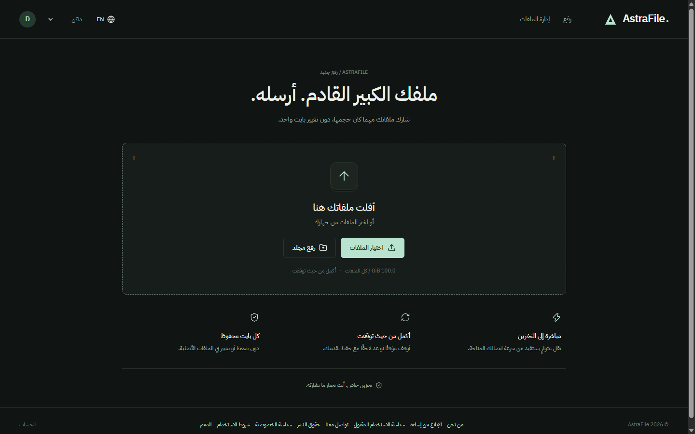
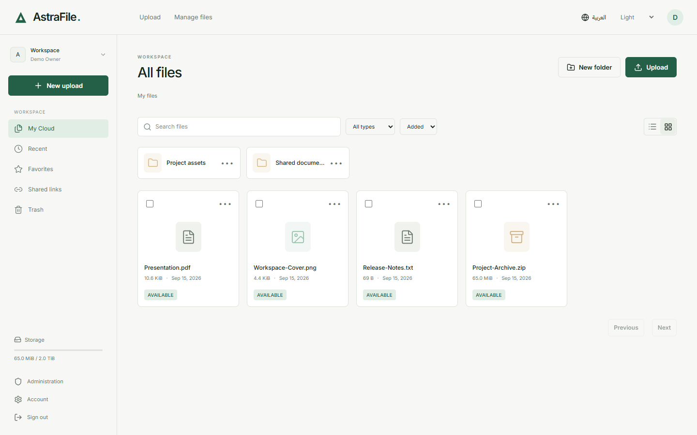
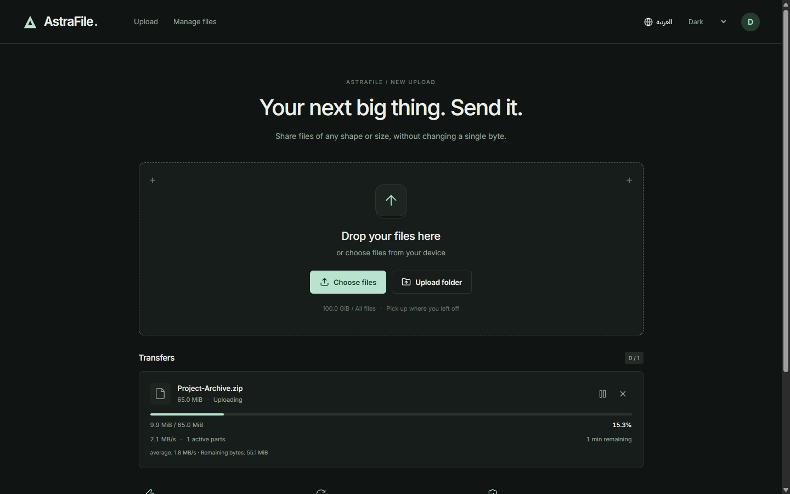
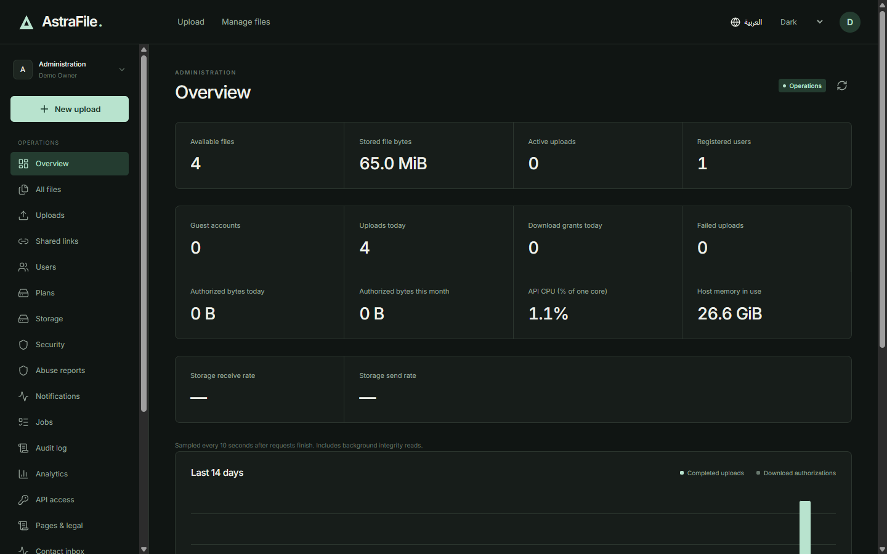
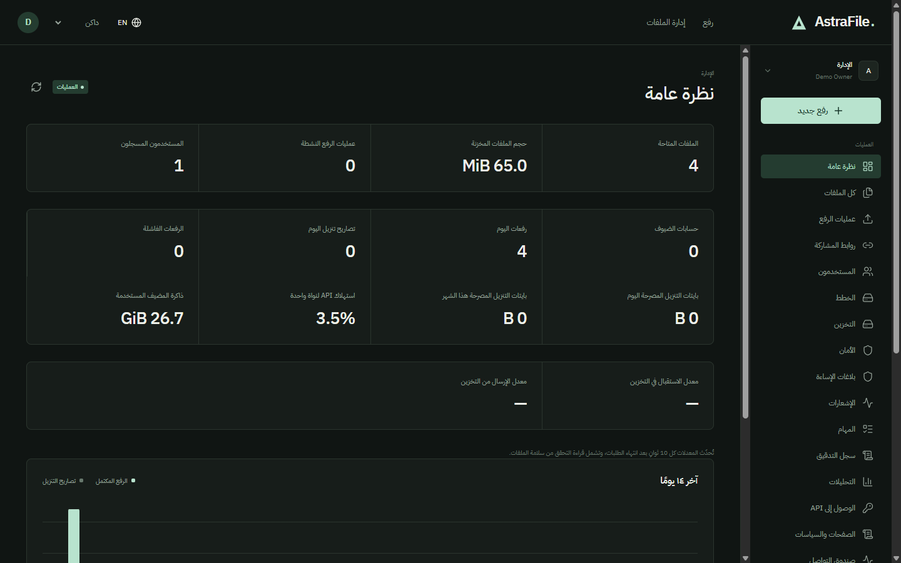
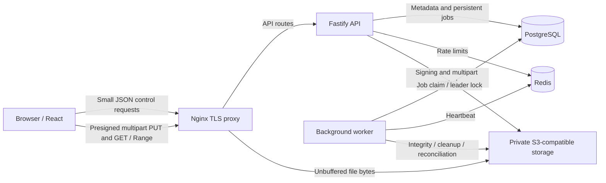

<p align="center"></p>

# AstraFileHost

### ملفاتك. سحابتك. تحكمك.

[English](README.en.md) | [العربية](README.ar.md)

AstraFileHost منصة حديثة ذاتية الاستضافة لمشاركة الملفات والسحابة الشخصية، صُممت لنقل الملفات الكبيرة، وحماية الخصوصية، واستكمال الرفع، والمشاركة الآمنة، والتحكم الإداري الكامل.

ارفع مرة واحدة. ادخل من أي جهاز. شارك بأمان.

   



## المحتويات

[نظرة عامة](#نظرة-عامة) · [الصور](#الصور) · [المزايا](#المزايا) · [نقل الملفات الكبيرة](#نقل-الملفات-الكبيرة) · [السحابة الشخصية](#السحابة-الشخصية) · [المشاركة الآمنة](#المشاركة-الآمنة) · [الخصوصية والأمان](#الخصوصية-والأمان) · [الإدارة](#الإدارة) · [اللغات](#اللغات) · [التقنيات](#التقنيات) · [البنية](#البنية) · [التثبيت](#التثبيت) · [الإعدادات](#الإعدادات) · [التخزين](#التخزين) · [التطوير](#التطوير) · [النشر](#النشر) · [واجهة API](#واجهة-api) · [محركات البحث](#محركات-البحث) · [التوجهات المستقبلية](#التوجهات-المستقبلية) · [الإبلاغ الأمني](#الإبلاغ-الأمني) · [الترخيص](#الترخيص) · [المساهمة](#المساهمة) · [شكر للمشاريع الأساسية](#شكر-للمشاريع-الأساسية)

## نظرة عامة

احتفظ بملفاتك على بنية تحتية تديرها بنفسك. تفصل المنصة بين طلبات التحكم الصغيرة عبر API وبين نقل محتوى الملفات؛ يرفع المتصفح مباشرة إلى تخزين خاص متوافق مع S3 باستخدام روابط مؤقتة محدودة الصلاحية. وتتيح واجهتا المستخدم والإدارة بالعربية والإنجليزية الوصول إلى البيانات نفسها.

تظهر الواجهة باسم **AstraFile**، بينما اسم المستودع **AstraFileHost**. النشر المرجعي مخصص لخادم واحد؛ وتبقى سعة التخزين والنسخ الاحتياطية وشهادة HTTPS الموثوقة مسؤولية المشغّل.

## الصور

<table>
<tr><td width="50%"><br>السحابة الشخصية</td><td width="50%"><br>الرفع القابل للاستكمال</td></tr>
<tr><td><br>إدارة المنصة</td><td><br>العربية واتجاه RTL</td></tr>
</table>

[استعرض الصور العشرين](docs/SCREENSHOTS.md). التُقطت من التطبيق العامل بدقة 1440 × 900، باستخدام بيانات تجريبية معزولة وحجب أسرار المشاركة. الصور ليست تصاميم مولّدة، والأرقام الظاهرة ليست إحصاءات خادم إنتاج.

## المزايا

| المجال | الإمكانات المنفذة |
|---|---|
| النقل | رفع S3 مجزأ، أجزاء متوازية، إيقاف واستكمال، إعادة المحاولة، استعادة IndexedDB، سرعة ووقت متبقٍ، تحقق SHA-256، تنزيل Range / 206 |
| الملفات | مجلدات متداخلة، بحث وترتيب، شبكة وقائمة، مفضلة وأحدث الملفات، نقل ونسخ وإعادة تسمية، سلة محذوفات واستعادة وإصدارات |
| المشاركة | ملفات ومجلدات، كلمات مرور، انتهاء صلاحية، حدود منح التنزيل، QR، إلغاء وتجديد الروابط |
| الحسابات | جلسات ضيوف، تسجيل ودخول، معرّف حساب عام، تفعيل يدوي، أجهزة متصلة، إلغاء الجلسات ومفاتيح API محددة النطاق |
| التشغيل | مستخدمون وخطط وحصص، صحة التخزين، أحداث أمنية وسجل تدقيق، مهام خلفية، دعم ومحتوى قانوني وSEO وإعدادات |

## نقل الملفات الكبيرة

يحسب المتصفح بصمة كل جزء داخل Web Worker، ثم يرسله إلى التخزين عبر طلب PUT موقّع. أحجام الأجزاء المتاحة **32 و64 و128 و256 MiB**، وعدد الأجزاء المتوازية **1–8**، والافتراضي 4. تعرض الواجهة التقدم والسرعة ومتوسطها والبايتات والوقت المتبقيين.

يمكن إيقاف النقل أو إعادة الاتصال مع الاحتفاظ بالأجزاء المكتملة. بعد إعادة تشغيل المتصفح، اختر الملف الأصلي مجددًا؛ تستعيد IndexedDB معلومات العملية وتطابق API الأجزاء مع `ListParts` من التخزين. يُتحقق من الأجزاء وحجم الكائن قبل الإكمال، ثم تحسب مهمة خلفية بصمة الملف الكامل. تبقى بايتات الملف الأصلية دون تغيير. يدعم التنزيل Range واستجابة HTTP 206 عند دعم مزود التخزين لهما.

تعتمد السرعة الفعلية على الجهاز والشبكة والتخزين والحدود المهيأة؛ لا توجد سرعة مضمونة لجميع البيئات. راجع [بروتوكول الرفع](docs/UPLOAD_PROTOCOL.md).

## السحابة الشخصية

ادخل من جهاز آخر للوصول إلى ملفات الحساب ومجلداته نفسها. تُزامن التغييرات بالاستعلام الدوري عن سجل تغييرات الحساب. تدعم إدارة الملفات المجلدات المتداخلة والمفضلة والأحدث والبحث والترتيب والعرض الشبكي والقائمة والنقل والنسخ وإعادة التسمية. يمكن استعادة المحذوفات خلال مدة الاحتفاظ، وتمنع مراجعات الإصدارات استبدال تعديل متزامن دون اكتشاف التعارض.

الخطط حصص قابلة للتعديل إداريًا: تخزين **FREE الافتراضي 200 GiB** و**PRO الافتراضي 2 TiB**. تبقى الاستثناءات الخاصة بالحساب محفوظة عند تغيير خطته. هذه سياسات استخدام وليست أسعارًا تجارية ثابتة؛ **معالجة المدفوعات غير منفذة**. ويظل قبول الملفات خاضعًا للمساحة الفعلية المتاحة.

## المشاركة الآمنة

شارك ملفًا أو مجلدًا بسر عشوائي بطول 256 بت داخل جزء الرابط `fragment`. لا يُحفظ السر نفسه؛ تُحفظ بصمته المقيّدة بمفتاح. لا يمكن استرجاع سر مفقود، ويمكن إنشاء رابط جديد بدلًا منه. تدعم المشاركة كلمة مرور محفوظة بتجزئة آمنة، وانتهاء الصلاحية، وحدود منح التنزيل، وإلغاء الرابط وعرض QR. معرّف الحساب العام للتعريف فقط ولا يتيح تسجيل الدخول.

يمنع الإلغاء إصدار منح تنزيل جديدة. أما رابط التخزين الصادر مسبقًا فيبقى صالحًا حتى **15 دقيقة**، ويمكن استخدامه لطلبات Range متعددة. تقيس إحصاءات التنزيل وحصصه عمليات التفويض والبايتات المحجوزة، ولا تعني عدد التنزيلات المكتملة أو حجم حركة الشبكة الدقيق.

## الخصوصية والأمان

تُجزّأ كلمات المرور باستخدام Argon2id ولا تُخزّن بتشفير قابل للعكس. يُبحث عن البريد الإلكتروني عبر فهارس HMAC دون الاحتفاظ بعنوانه الصريح. تُشفّر حقول مختارة، مثل الأسماء وتسميات الأجهزة ومحتوى الدعم، باستخدام AES-256-GCM المرتبط بالسجل. تفصل خمس مجموعات مفاتيح مستقلة ذات إصدارات بين أغراض الخصوصية. تستخدم الجلسات ملفات ارتباط HttpOnly، ويتطلب الإنتاج HTTPS. تُفحص الملكية والأدوار ونطاقات API والحصص في الخادم.

تستبعد السجلات بيانات الاعتماد وأجسام الطلبات ومعلمات الروابط الموقعة. لا تدخل مفاتيح التخزين الخاصة إلى حزمة المتصفح. المنصة **ليست عديمة المعرفة ولا توفر تشفيرًا طرفيًا لمحتوى الملفات**؛ يستطيع الخادم الوصول إلى بايتاتها. فحص البرمجيات الضارة اختياري ويحتاج إلى إعداد وتفعيل، وهو غير نشط افتراضيًا.

راجع [الأمان بالعربية](docs/ar/SECURITY.md)، و[تفصيل النموذج الأمني](docs/SECURITY.md)، و[خريطة البيانات](docs/PRIVACY_DATA_MAP.md)، و[النسخ والاستعادة](docs/BACKUP_AND_RESTORE.md).

## الإدارة

تشمل لوحة الإدارة النظرة العامة، والمستخدمين وتفعيلهم بمعرّف الحساب، والملفات والرفع والمشاركة والتخزين، والخطط والحصص، والأحداث الأمنية وبلاغات الإساءة وسجل التدقيق والمهام والتحليلات، وبيانات مفاتيح API والإشعارات وصحة الخدمات. كما تشمل صفحات قانونية باللغتين وSEO وصندوق الدعم والإعدادات.

يتحكم OWNER في رفع الصلاحيات؛ ويدير ADMIN المستخدمين والإعدادات والمهام؛ ويتولى MODERATOR الإشراف؛ ويمكن لـ SUPPORT قراءة الشاشات المسموح بها وإدارة محادثات الدعم. تخضع العمليات كلها لتحقق الخادم. [دليل الإدارة](docs/ar/ADMIN.md).

## اللغات

العربية والإنجليزية مدمجتان، مع اتجاه RTL ومحتوى مترجم ومظهر داكن وفاتح وتلقائي وخطوط مستضافة محليًا. تستخدم الصفحات العامة `/en` و`/ar`، ولكل لغة محتواها وبياناتها الوصفية. تتوفر أيضًا [أدلة تشغيل عربية](docs/ar/INSTALLATION.md).

## التقنيات

| الطبقة | التقنيات المستخدمة |
|---|---|
| المتصفح | React 19، TypeScript، Vite 8، React Router، IndexedDB |
| API | Node.js ≥ 22.12، Fastify 5، Zod |
| البيانات الوصفية | PostgreSQL 17، مكتبة `pg`، ترحيلات SQL ذات إصدارات |
| التنسيق | Redis 7 للحدود والنبضات؛ مهام PostgreSQL وقفل انتخاب العامل |
| الملفات | AWS S3 SDK؛ SeaweedFS 4.45 في النشر المرفق |
| البنية التشغيلية | Docker Compose، Nginx لإنهاء TLS وتمرير الملفات دون تخزين مؤقت |
| الاختبارات | Vitest، Playwright، اختبارات تكامل |

## البنية



لا تمر بايتات الملفات عبر Node API. يصل المتصفح إلى التخزين مباشرة في التطوير المحلي، بينما يمر النقل في قالب الإنتاج عبر Nginx إلى التخزين الخاص دون تخزين مؤقت للملف. [تفاصيل البنية والاتساق](docs/ARCHITECTURE.md).

## التثبيت

المتطلبات: Node.js **≥ 22.12** وnpm وGit وDocker مع Compose. يُنصح بتوفير 40 GiB على الأقل كبداية، إضافة إلى مساحة الملفات والنسخ؛ يطبق الرفع أيضًا حدًا أدنى قابلًا للضبط للمساحة الحرة.

```sh
git clone https://github.com/gqn3/AstraFileHost.git
cd AstraFileHost
npm ci
npm run setup:local
docker compose --env-file .env -f infra/compose/local.yml up -d --build --wait
npm run migrate
npm run storage:init
npm run dev
```

افتح **http://localhost:18400** وأكمل `/setup` باستخدام الرمز الموجود محليًا في `.secrets/bootstrap-token` وبيانات حساب تختارها. أبقِ الرمز خاصًا. يتطلب استنساخ المستودع الخاص صلاحية وصول.

ينشئ `setup:local` أسرارًا مستقلة ويرفض وجود `.env` سابق؛ **لا تنسخ `.env.example` قبله** عند اتباع هذا المسار. احتفظ بالأسرار عند التشغيل اللاحق، وشغّل API والعامل الخلفي معًا. [التثبيت المفصل](docs/ar/INSTALLATION.md) · [استكشاف الأعطال](docs/TROUBLESHOOTING.md).

## الإعدادات

يحتوي [`.env.example`](.env.example) على أمثلة بديلة فقط. تُحفظ إعدادات البنية الحساسة في بيئة محمية، بينما تُدار سياسات الرفع والخطط والحصص والمظهر وSEO من لوحة الإدارة. [دليل الإعدادات العربي](docs/ar/CONFIGURATION.md) · [مرجع جميع المتغيرات](docs/CONFIGURATION.md).

## التخزين

الخيار المرفق هو SeaweedFS مع حاوية S3 خاصة. يتطلب استخدام مزود متوافق آخر، بما فيه MinIO، اختبار البصمات والرفع المجزأ والاستكمال والتوقيع وCORS وRange. عيّن عنوانًا يصل إليه الخادم وآخر يصل إليه متصفح المستخدم؛ اسم خدمة Docker الداخلي لا يصلح عنوانًا عامًا للمتصفح. [التهيئة والأمثلة](docs/STORAGE.md).

## التطوير

```sh
npm run typecheck
npm test
npm run build
```

تحتاج اختبارات التكامل والمتصفح إلى تثبيت تجريبي قابل للاستغناء عنه:

```sh
npm run test:integration
npm run test:e2e
```

تُنشئ هذه الاختبارات بيانات وتغيّرها؛ لا توجّهها إلى الإنتاج. لا يوجد أمر formatter أو lint مهيأ، وتستخدم CI أوامر التحقق الفعلية. [دليل التطوير](docs/DEVELOPMENT.md) · [المساهمة](CONTRIBUTING.md).

## النشر

يستخدم النشر المرجعي شبكة Compose معزولة وخدمات قاعدة بيانات وذاكرة مؤقتة وتخزين خاصة وأسرارًا مركّبة ووكيل TLS مخصصًا. التهيئة الأولى خاصة بـ Linux وترفض الكتابة فوق تثبيت قائم. ثبّت شهادة موثوقة وهيّئ النسخ الاحتياطية وسعة الخادم قبل استقبال المستخدمين. نشر هذا المستودع لا ينشر تطبيقًا على خادم. [دليل النشر](docs/ar/DEPLOYMENT.md).

## واجهة API

تنشئ طلبات JSON الصغيرة عمليات الرفع وتفوّض النقل إلى التخزين. تدعم مفاتيح API محددة النطاق عمليات الملفات والرفع والمشاركة، ولا تتيح مسارات الإدارة أو الجلسات. تتطلب الوثائق التفاعلية في `/api/docs` حسابًا مخوّلًا من الطاقم. [مرجع المسارات](docs/API.md).

## محركات البحث

تدعم الصفحات العامة باللغتين بيانات وصفية وروابط canonical وبدائل لغوية وبيانات منظمة وrobots وخريطة موقع. تُستبعد شاشات العمل والإدارة والمشاركة من الفهرسة. يمكن تجهيز معرّفات التحليلات، لكن التتبع معطل إلى حين دمج الموافقة. [دليل SEO والنشر](docs/SEO.md).

## التوجهات المستقبلية

يوثّق الإصدار 1.0.0 التطبيق المنفذ. تُناقش التطويرات التالية عبر مسائل المستودع دون جدول زمني مضمون. من المجالات الممكنة توسيع اختبارات توافق المزودين والنشر الموزع وتحليلات تراعي الموافقة؛ لا تُعد هذه مزايا مشمولة في الإصدار الحالي.

## الإبلاغ الأمني

اتبع [SECURITY.md](SECURITY.md) ونسّق بصورة خاصة قبل نشر تفاصيل الثغرات. لا ترفق بيانات اعتماد أو روابط جلسات ومشاركة أو سجلات خاصة أو ملفات مستخدمين في المسائل.

## الترخيص

لم يُحدّد ترخيص برمجي للمشروع بعد، ولا يمنح المستودع ترخيصًا مفتوح المصدر لإعادة الاستخدام. تحويله إلى مستودع عام مستقبلًا لا يمنح تلقائيًا حق الاستخدام غير المقيد. يلزم قرار صريح من المالك قبل إعلان ترخيص.

## المساهمة

اقرأ [CONTRIBUTING.md](CONTRIBUTING.md)، واستخدم بيانات مصطنعة للتحقق، واذكر نتائج الاختبارات في طلب الدمج. راجع [سجل التغييرات](CHANGELOG.md) لمعرفة محتوى الإصدارات.

## شكر للمشاريع الأساسية

يعتمد المشروع على React وFastify وPostgreSQL وRedis وSeaweedFS وAWS SDK وNginx وغيرها من الحزم المسجلة في `package-lock.json`. تبقى تراخيص هذه المشاريع مستقلة ولا تُنشئ ترخيصًا لـ AstraFileHost.
