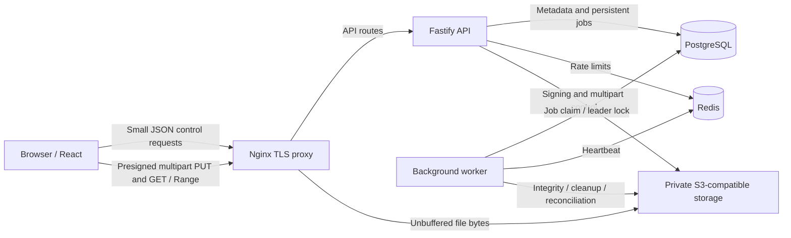

<p align="center"></p>

# AstraFileHost

### Your files. Your cloud. Your control.

[English](README.en.md) | [العربية](README.ar.md)

AstraFileHost is a modern self-hosted file sharing and personal cloud platform built for large-file transfers, privacy, resumable uploads, secure sharing, and administrative control.

Upload once. Access everywhere. Share securely.

   


## Explore

[Overview](#overview) · [Screenshots](#screenshots) · [Features](#features) · [Large transfers](#large-file-transfers) · [Personal cloud](#personal-cloud) · [Sharing](#secure-sharing) · [Security](#privacy--security) · [Administration](#administration) · [Languages](#internationalization) · [Stack](#technology-stack) · [Architecture](#architecture) · [Installation](#installation) · [Configuration](#configuration) · [Storage](#object-storage) · [Development](#development) · [Deployment](#production-deployment) · [API](#api) · [SEO](#seo) · [Roadmap](#roadmap) · [Security reporting](#security-reporting) · [License](#license) · [Contributing](#contributing) · [Acknowledgements](#acknowledgements)

## Overview

Keep your files on infrastructure you operate. AstraFileHost separates small API control requests from the transfer of file bytes: the browser uploads directly to private S3-compatible storage using limited, signed URLs. A bilingual workspace and administration interface manage the same persistent data.

The interface uses the shorter product name **AstraFile**. This repository is **AstraFileHost**. It is a single-server reference deployment; backups, capacity planning and trusted HTTPS remain operator responsibilities.

## Screenshots

<table>
<tr><td width="50%"><br>Personal cloud</td><td width="50%"><br>Resumable transfers</td></tr>
<tr><td><br>Administration</td><td><br>Arabic / RTL</td></tr>
</table>

[View all 20 screenshots](docs/SCREENSHOTS.md). Captured from the running application at 1440 × 900 with isolated demo data. Share capabilities are masked. These are real UI captures, not generated mockups or production metrics.

## Features

| Area | Implemented capabilities |
|---|---|
| Transfers | S3 multipart, parallel parts, pause/resume, retries, IndexedDB recovery, speed/ETA, SHA-256 validation, HTTP Range / 206 |
| Workspace | Nested folders, search/sort, grid/list, favorites/recent, move/copy/rename, trash/restore, file versions |
| Sharing | File/folder links, passwords, expiration, download-grant limits, QR codes, revoke/regenerate |
| Accounts | Guest sessions, registration/login, public Account ID, manual activation, connected devices, session revocation, scoped API keys |
| Operations | Users, quotas/plans, storage health, security/audit, persistent jobs, support inbox, CMS, SEO and settings |

## Large File Transfers

The browser hashes each part in a Web Worker and sends it to storage using a presigned PUT. Part size is configurable to **32, 64, 128 or 256 MiB**; concurrency is **1–8** (default 4). Transfer progress includes speed, average rate, remaining bytes and ETA.

Pause or reconnect without discarding completed parts. After a browser restart, reselect the original file: IndexedDB restores the intent and the API reconciles storage's authoritative `ListParts` response. Completion validates parts and object size; a background job computes the full-object checksum. Files retain their original bytes. Downloads support Range requests and HTTP 206 when supported by the configured storage provider.

Actual throughput depends on the client, network, storage and configured limits. There is no universal speed guarantee. See [upload protocol](docs/UPLOAD_PROTOCOL.md).

## Personal Cloud

Sign in from another device to access the same files and folders. Changes are synchronized through per-account change polling. Manage nested folders, favorites, recent items, sorting, searching, grid/list views, moves, copies and renames. Trash can be restored before retention cleanup. Version history uses revision checks to prevent conflicting changes from silently overwriting each other.

Plans are administrator-configurable entitlements: **FREE defaults to 200 GiB**, **PRO to 2 TiB**. Per-account overrides survive plan changes. These are storage policies, not fixed commercial prices; payment processing is not implemented. Physical free-space checks still apply.

## Secure Sharing

Share files or folders using random 256-bit fragment secrets. Only keyed digests are retained; a lost secret cannot be recovered and must be regenerated. Optional passwords use secure hashing. Set expiry, download-grant limits, revoke a link or display its QR code. Account IDs identify accounts but confer no authentication capability.

Revocation stops new download grants. A storage URL already issued remains usable for up to **15 minutes**, including repeated Range requests. Download counts and bandwidth quotas measure authorizations/reserved bytes, not confirmed completed downloads or exact wire traffic.

## Privacy & Security

Passwords use Argon2id, never reversible encryption. Email lookup uses HMAC blind indexes without retaining plaintext email. Selected names, device labels and support content use record-bound AES-256-GCM. Five independent versioned key rings separate privacy purposes. Sessions use HttpOnly cookies; production requires HTTPS. Roles, ownership, API scopes and quotas are enforced by the server.

Logs omit credentials, request bodies and signed query strings. Private storage credentials never enter the browser bundle. This is **not zero-knowledge or end-to-end encrypted storage**: the server can access uploaded file bytes. Optional malware scanning must be configured and enabled; it is not active by default.

Read the [security model](docs/SECURITY.md), [privacy data map](docs/PRIVACY_DATA_MAP.md) and [backup guide](docs/BACKUP_AND_RESTORE.md).

## Administration

The administration workspace covers overview, users and activation by Account ID, uploads, files, shares, storage, plans and quotas, security events, abuse reports, audit logs, jobs, analytics, API-key metadata, notifications and system health. It also provides bilingual legal pages, SEO, a contact/support inbox and application settings.

OWNER controls role elevation; ADMIN manages settings/users/jobs; MODERATOR handles moderation; SUPPORT can read permitted operational screens and manage support conversations. All actions remain subject to server checks. See [administration](docs/ADMIN_GUIDE.md).

## Internationalization

English and Arabic are built in, including RTL layout, localized content, dark/light/system themes and self-hosted fonts. Public pages use `/en` and `/ar`; CMS pages have separate language content and metadata. [Arabic operations documentation](docs/ar/INSTALLATION.md) is included.

## Technology Stack

| Layer | Implementation |
|---|---|
| Browser | React 19, TypeScript, Vite 8, React Router, IndexedDB |
| API | Node.js ≥ 22.12, Fastify 5, Zod |
| Metadata | PostgreSQL 17, `pg`, versioned SQL migrations |
| Coordination | Redis 7 for rates/heartbeat; PostgreSQL jobs and advisory worker lock |
| File storage | AWS S3 SDK; SeaweedFS 4.45 in the bundled deployment |
| Infrastructure | Docker Compose, Nginx TLS / unbuffered storage proxy |
| Validation | Vitest, Playwright, integration scripts |

## Architecture



File bytes bypass the Node API. Local development reaches the storage endpoint directly; the production template streams through Nginx to the same private storage service. [Architecture and consistency](docs/ARCHITECTURE.md).

## Installation

Requires Node.js **≥ 22.12**, npm, Git and Docker with Compose. Allow at least 40 GiB free for the reference setup; uploads also enforce a configurable free-space floor.

```sh
git clone https://github.com/gqn3/AstraFileHost.git
cd AstraFileHost
npm ci
npm run setup:local
docker compose --env-file .env -f infra/compose/local.yml up -d --build --wait
npm run migrate
npm run storage:init
npm run dev
```

Open **http://localhost:18400**. Complete `/setup` with the token saved locally in `.secrets/bootstrap-token` and your own account credentials. Keep that file private. The repository is private, so cloning requires access.

`setup:local` generates independent secrets and refuses an existing `.env`; do not copy `.env.example` first for this path. On later runs, preserve `.env` and the existing secrets. The API and worker must both run. [Full installation](docs/INSTALLATION.md) · [Troubleshooting](docs/TROUBLESHOOTING.md).

## Configuration

[`.env.example`](.env.example) contains placeholders only. Secret infrastructure settings live in the protected environment; upload rules, plans, quotas, appearance and SEO are managed through authenticated administration. [Complete configuration reference](docs/CONFIGURATION.md).

## Object Storage

The bundled backend is SeaweedFS with a private S3 bucket. External S3-compatible providers, including MinIO, require compatibility validation for checksums, multipart recovery, presigning, CORS and Range requests. Configure both a server-reachable endpoint and a browser-reachable endpoint. An internal Docker hostname cannot serve as the public browser endpoint. [Storage configuration and examples](docs/STORAGE.md).

## Development

```sh
npm run typecheck
npm test
npm run build
```

Integration and browser suites require a disposable running installation:

```sh
npm run test:integration
npm run test:e2e
```

They create and modify test data. Do not target production. No formatter or lint command is configured; CI runs the actual validation scripts. [Development and test guide](docs/DEVELOPMENT.md) · [Contributing](CONTRIBUTING.md).

## Production Deployment

The reference deployment uses an isolated Compose network, private database/cache/storage services, mounted secrets and a dedicated TLS proxy. Initial provisioning is Linux-only and refuses to overwrite an existing deployment. Install a trusted certificate before serving users, configure backups and size the host for the workload. Publishing this repository does not deploy an instance. [Deployment guide](docs/DEPLOYMENT.md).

## API

Small JSON requests create upload intents and authorize storage transfers. Scoped API keys support file/upload/share operations; keys cannot enter administration or session routes. Interactive documentation at `/api/docs` requires staff access. [Endpoint reference](docs/API.md).

## SEO

Public English/Arabic pages expose metadata, canonical/alternate links, structured data, robots and sitemap controls. Private workspace, admin and share pages are excluded from indexing. Analytics identifiers may be configured, but tracking remains disabled pending consent integration. [SEO and publishing](docs/SEO.md).

## Roadmap

Version 1.0.0 documents the implemented application. Future changes are evaluated through repository issues; there is no promised schedule. Possible extension areas include provider-specific compatibility coverage, distributed deployments and consent-aware analytics. None is advertised as part of this release.

## Security Reporting

Follow [SECURITY.md](SECURITY.md). Coordinate privately before publishing vulnerability details. Never attach credentials, session/share links, private logs or user files to an issue.

## License

No software license has been selected. No open-source reuse license is granted by this repository. A future public visibility change would not itself grant unrestricted reuse. The maintainer must make an explicit license decision before such claims are made.

## Contributing

Read [CONTRIBUTING.md](CONTRIBUTING.md), reproduce changes with synthetic data and include validation results in your pull request. Review [CHANGELOG.md](CHANGELOG.md) for release history.

## Acknowledgements

Built on React, Fastify, PostgreSQL, Redis, SeaweedFS, the AWS SDK, Nginx and the other dependencies recorded in `package-lock.json`. Their licenses remain with their respective projects; they do not establish a license for AstraFileHost.
