# Screenshot gallery / معرض الصور

[Project overview](../README.md) · [العربية](../README.ar.md)

These 20 real screenshots were captured from the local application on 2026-09-15 at **1440 × 900** using a fresh, isolated database and private object store. Only synthetic demo files and a demo owner were used. No production account data, live credentials, browser chrome or capability secrets are included. The upload progress image shows an actual transfer with local browser network throttling, not a performance benchmark. Empty security history reflects the fresh demo state.

صور حقيقية من تثبيت تجريبي معزول، وليست بيانات مستخدمين أو مقاييس إنتاج. حُجبت قدرة المشاركة في صورة الإكمال.

<table>
<tr><td width="50%"><a href="assets/screenshots/01-home-dark.png">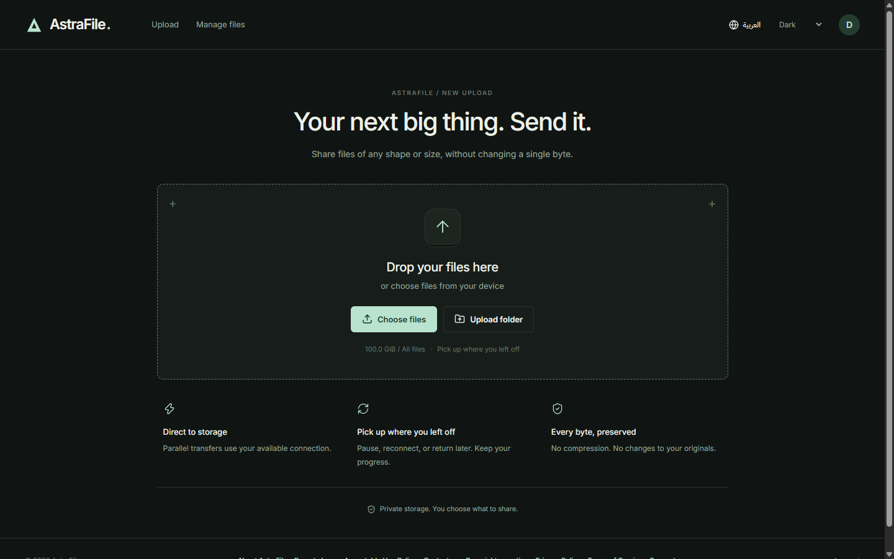</a> Home · dark</td><td width="50%"><a href="assets/screenshots/02-home-light.png">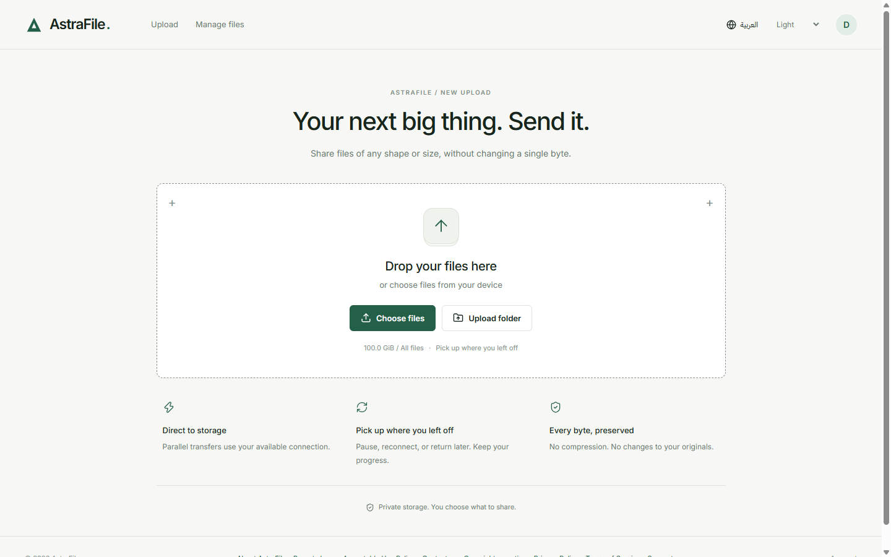</a> Home · light</td></tr>
<tr><td width="50%"><a href="assets/screenshots/03-upload.png">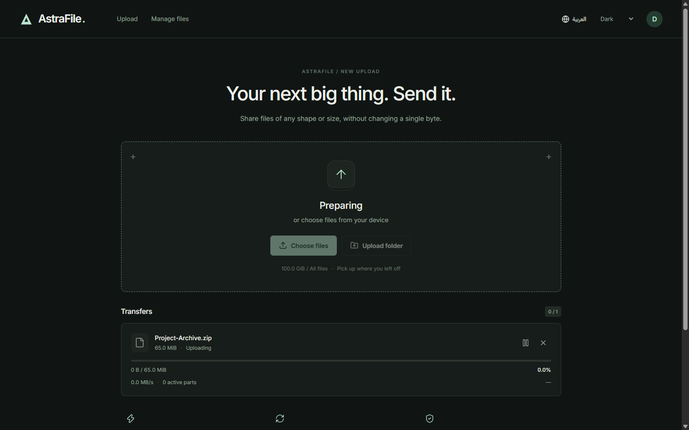</a> Selecting and preparing a real upload</td><td width="50%"> Actual multipart transfer in progress</td></tr>
<tr><td width="50%"><a href="assets/screenshots/05-upload-complete.png">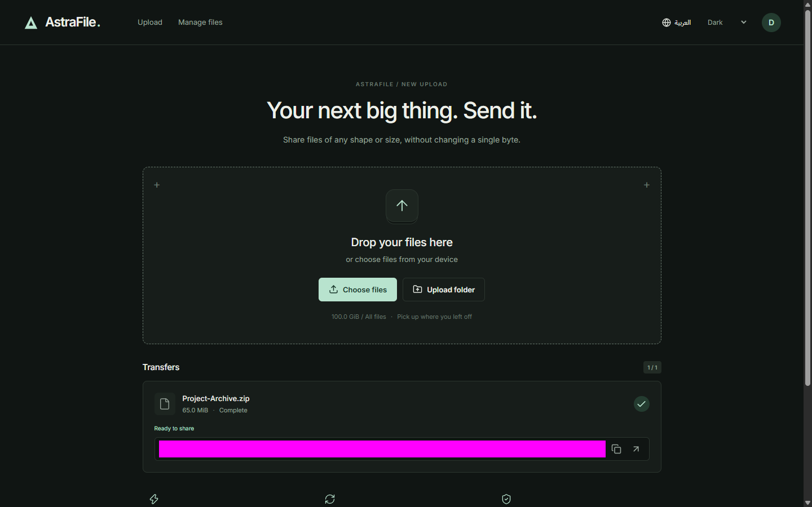</a> Completed transfer · capability masked</td><td width="50%"> My Cloud · light</td></tr>
<tr><td width="50%"><a href="assets/screenshots/07-file-manager-grid.png">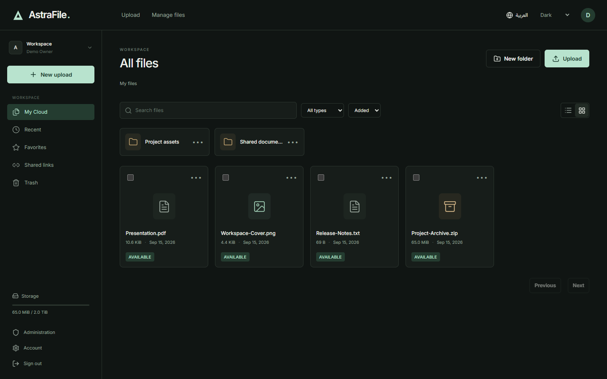</a> File manager · grid</td><td width="50%"><a href="assets/screenshots/08-file-manager-list.png">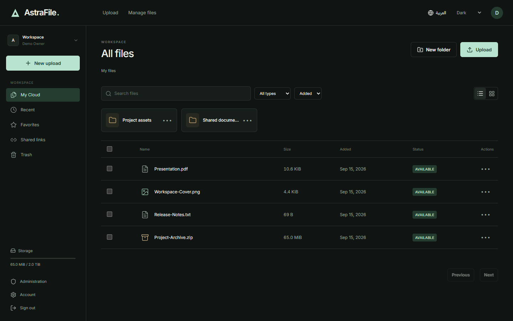</a> File manager · list</td></tr>
<tr><td width="50%"><a href="assets/screenshots/09-share-page.png">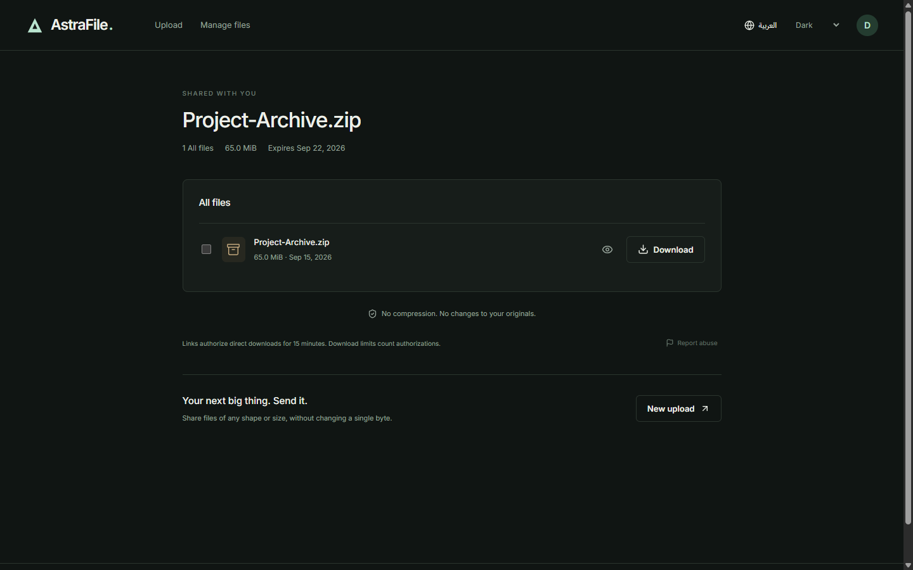</a> Resolved public share · secret removed</td><td width="50%"><a href="assets/screenshots/10-login.png">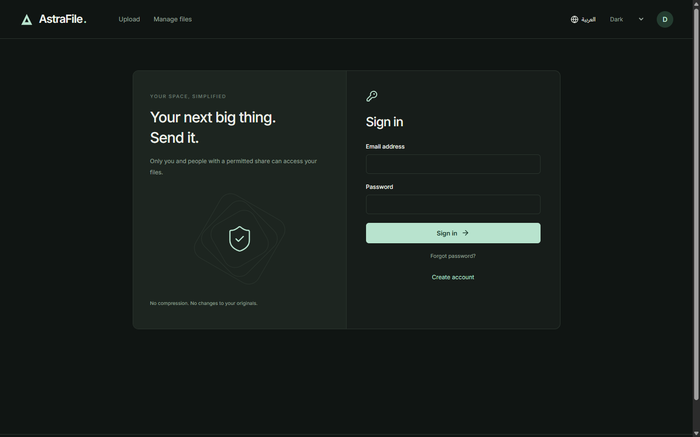</a> Sign in</td></tr>
<tr><td width="50%"><a href="assets/screenshots/11-account-devices.png">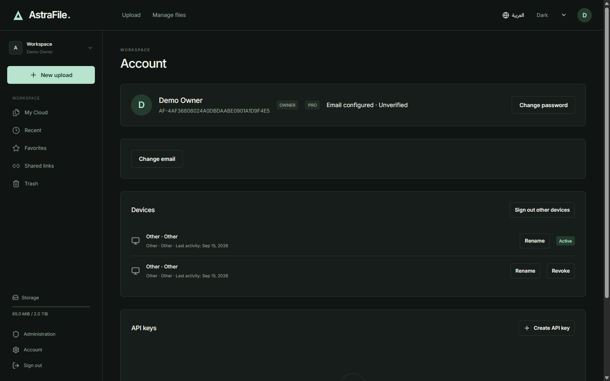</a> Account and connected devices</td><td width="50%"> Administration overview</td></tr>
<tr><td width="50%"><a href="assets/screenshots/13-admin-users.png">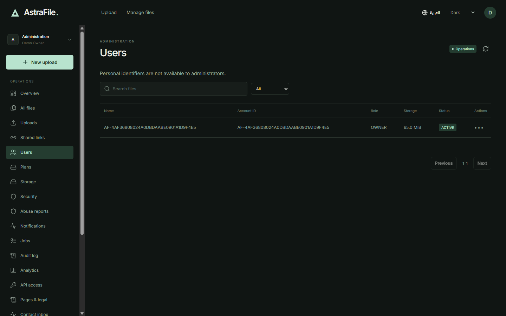</a> Users and Account IDs</td><td width="50%"><a href="assets/screenshots/14-admin-storage.png">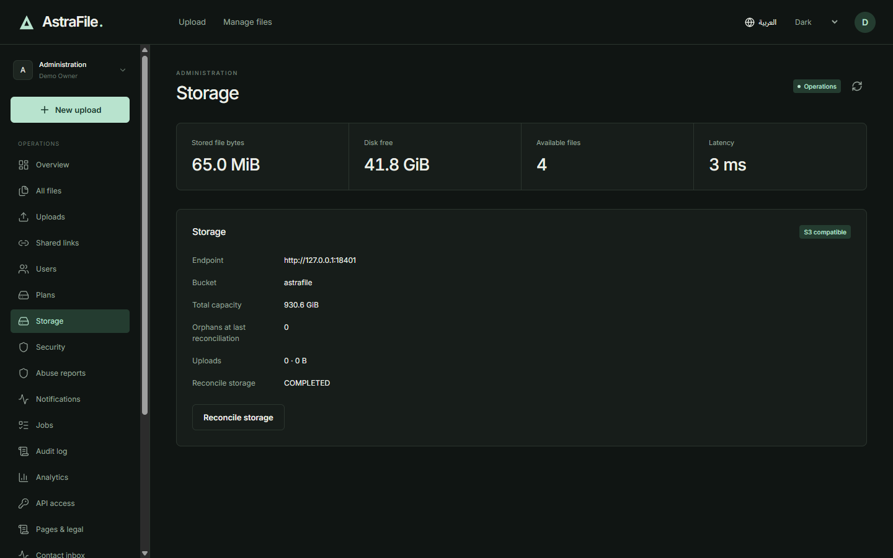</a> Local storage health</td></tr>
<tr><td width="50%"><a href="assets/screenshots/15-admin-security.png">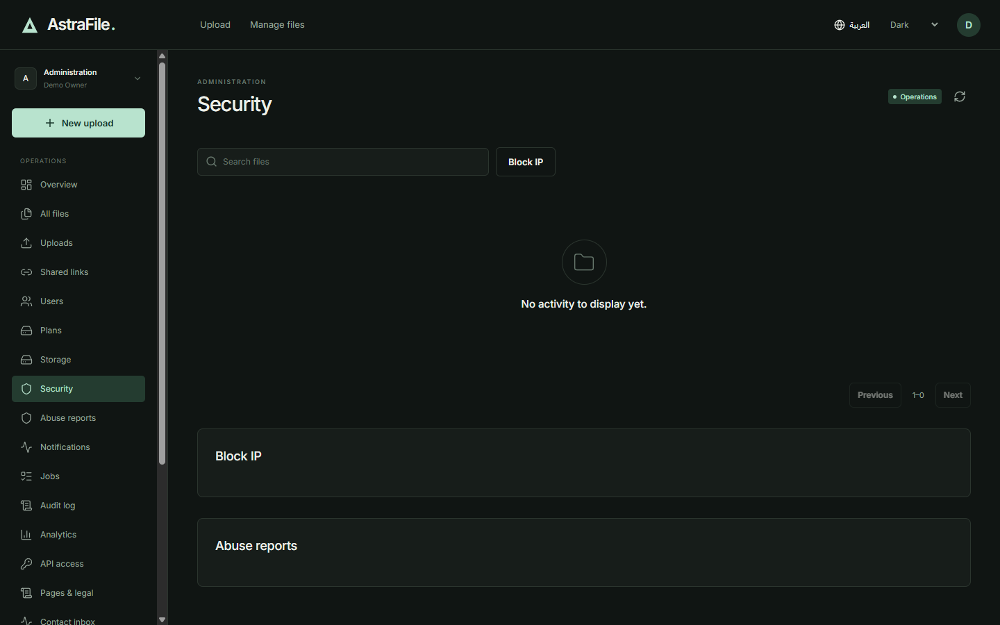</a> Security</td><td width="50%"><a href="assets/screenshots/16-admin-seo.png">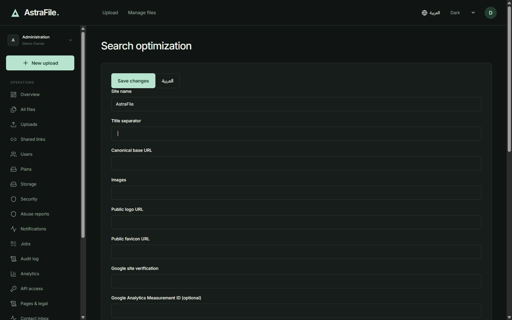</a> Search optimization</td></tr>
<tr><td width="50%"><a href="assets/screenshots/17-admin-legal-cms.png">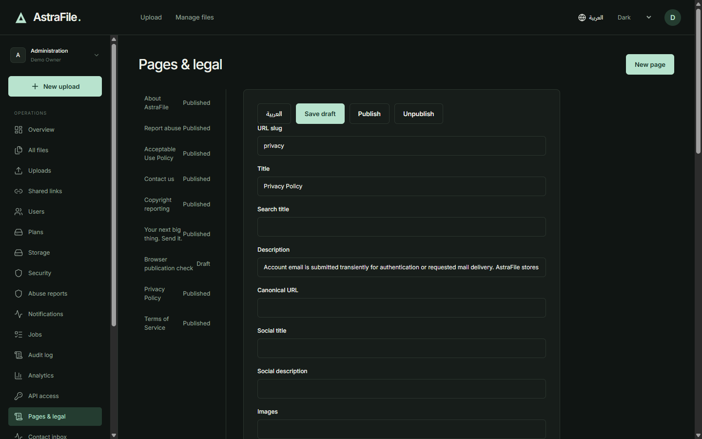</a> Pages and legal CMS</td><td width="50%"><a href="assets/screenshots/18-admin-settings.png">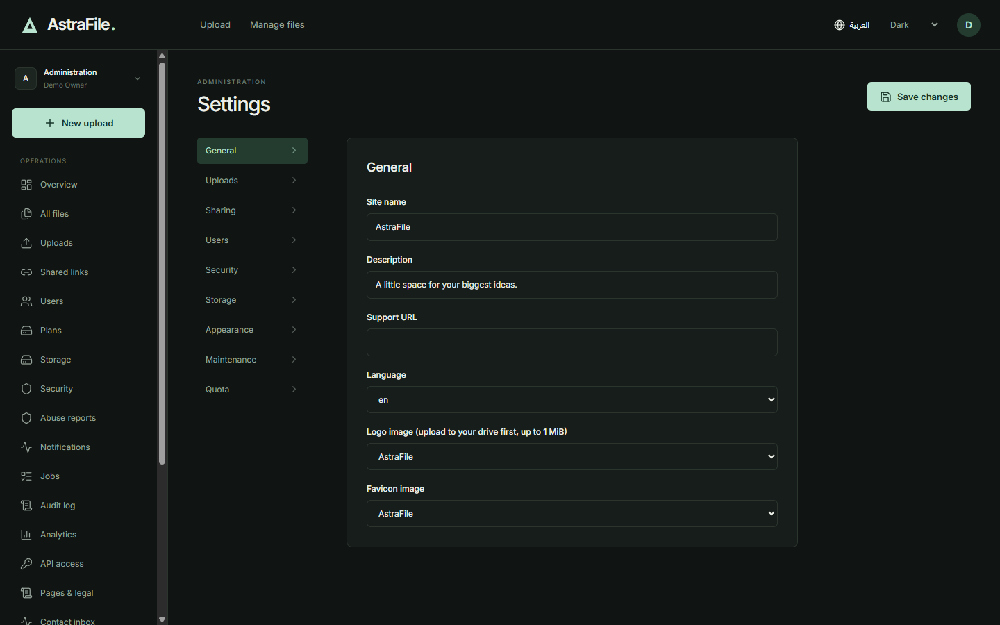</a> Application settings</td></tr>
<tr><td width="50%"> Arabic home · RTL</td><td width="50%"> Arabic administration · RTL</td></tr>
</table>
